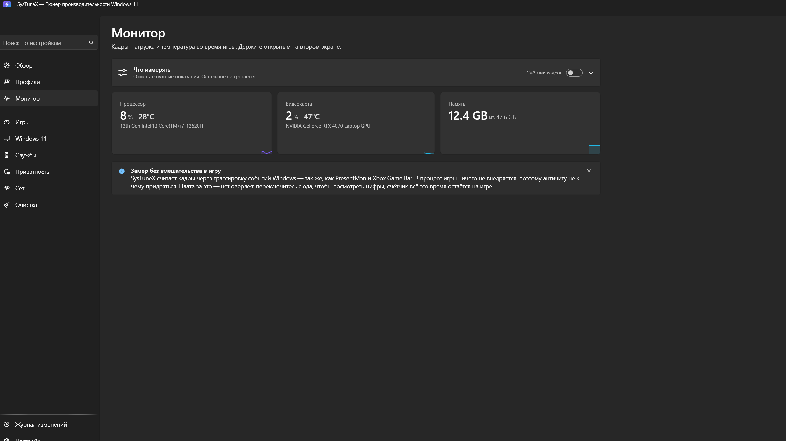

# SysTuneX

### Optimizador gaming para Windows 10/11 y monitor de FPS configurable

**Exprime Windows al máximo. Controla cada fotograma. Revierte los cambios con precisión.**

Optimizador de Windows gratuito y de código abierto para gamers: perfiles de rendimiento, modo juego y monitorización de **FPS, 1% low, frame time, CPU, GPU, RAM y temperaturas**.

[English](README.md) · [Русский](README.ru.md) · [Українська](README.uk.md) · [Español](README.es.md)

[⬇️ **Descargar SysTuneX**](https://github.com/Anton-Babaskin/SysTuneX/releases/latest/download/SysTuneX.exe) · [Última versión](https://github.com/Anton-Babaskin/SysTuneX/releases/latest) · [SHA-256](https://github.com/Anton-Babaskin/SysTuneX/releases/latest/download/SHA256SUMS.txt) · [Informar de un error](https://github.com/Anton-Babaskin/SysTuneX/issues)

## Todo lo que importa al jugar

- 🎮 Perfiles para FPS competitivos, battle royale, mundo abierto, simulación, streaming y máximo rendimiento.
- 📈 Panel configurable: FPS, 1% low, frame time, carga y temperatura de CPU/GPU, RAM, ventilador y procesos.
- ⚡ Game Mode temporal que restaura los servicios y el plan de energía anterior al terminar.
- ↩️ Registro de cambios y restauración exacta del estado real anterior.
- 🛡️ Conteo de fotogramas mediante Windows ETW, sin inyectar código en el juego.
- 🧹 Limpieza, red, privacidad, servicios y diagnóstico en una sola aplicación.

## Seguridad y límites claros

SysTuneX guarda el estado original de cada ajuste compatible antes de modificarlo. Los cambios avanzados explican sus consecuencias y requieren confirmación. La aplicación no promete el mismo aumento de FPS en todos los equipos. El monitor es un panel configurable para una segunda pantalla, no un overlay dentro del juego.

## Requisitos

- Windows 10 1809 / build 17763 o posterior
- Windows 11
- x64
- Permisos de administrador
- No requiere instalar .NET

## Inicio rápido

1. Descarga la versión actual de `SysTuneX.exe`.
2. Si quieres, verifica el archivo con `SHA256SUMS.txt`.
3. Ejecuta la aplicación como administrador.
4. Revisa las descripciones y niveles de riesgo antes de aplicar cambios.

> El ejecutable todavía no está firmado digitalmente, por lo que Windows SmartScreen puede mostrar una advertencia.

La documentación técnica completa, la arquitectura y las instrucciones de compilación están disponibles en el [README en inglés](README.md). El proyecto se distribuye bajo la licencia [MIT](LICENSE).
